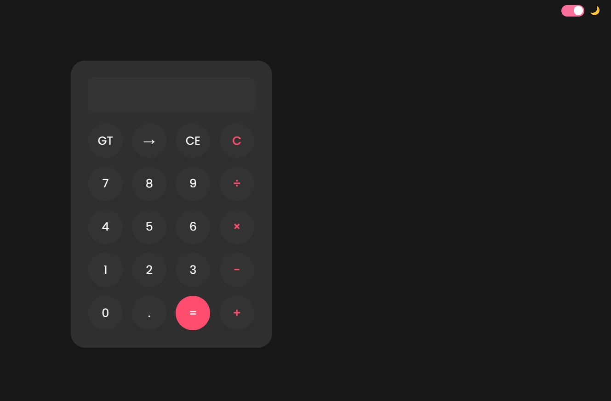

# 🧮 DevCalc - Aesthetic Calculator

DevCalc is a clean and minimal calculator designed with a Pinterest-inspired theme using HTML, CSS, and JavaScript. It supports basic arithmetic operations, light/dark mode, keyboard support, and sound feedback — all wrapped in a beautiful, responsive UI.



---

## 🔧 Features

- 🎨 Beautiful rounded button design
- 🌗 Light/Dark mode toggle
- 🎧 Sound on button click
- ➕ Basic operations: Add, Subtract, Multiply, Divide
- ⌨️ Keyboard input support
- 🔁 Clear Entry and Clear All
- 📱 Fully responsive for mobile devices

---

## 🚀 Live Demo

👉 Try it here: [DevCalc Live](https://24jainnikita.github.io/DevCalc)

---

## 🛠️ Built With

- HTML5
- CSS3
- JavaScript (ES6)

---

## 🧪 How to Run Locally

1. **Clone the repository**
   ```bash
   git clone https://github.com/24jainnikita/DevCalc.git
